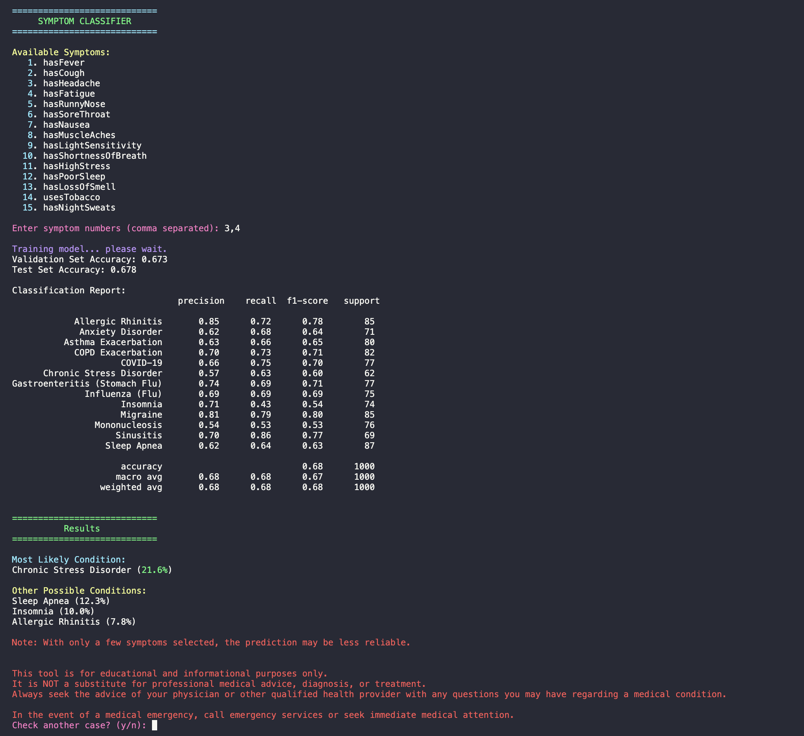

# Selene: A Symptom Classification Model  
**Author:** Rajat Sharma, University of Nevada, Reno  

---

## Overview  
Selene is a small machine learning system that predicts possible health conditions based on symptoms entered by the user.  
It uses a **Random Forest classifier** trained on a synthetic dataset that mimics realistic patient symptom patterns and diagnostic reasoning.  
The idea was to see how far to go with a simple, explainable model before getting into more complex pipelines.  

**Selene** is not for clinical use; it is simply a proof of concept for how early-stage AI in healthtech could assist with diagnostic support.

---

## Technical Summary  
- **Model:** RandomForestClassifier via scikit-learn  
- **Language:** Python  
- **Libraries:** pandas, scikit-learn, colorama  
- **Dataset:** 10,000 generated cases covering 15 conditions and 15 symptoms  
- **Interface:** CLI w/ instant prediction system  

---

## Research Relevance  
This project explores how structured symptom data transforms into something a model can reason about.  
While again far from clinical-grade, the underlying logic mirrors that of decision-support systems used in healthcare: collecting features, training models, and interpreting results to guide early assessments.  

With further development, this work could evolve into a more robust reasoning model that extends to include temporal pattern tracking of symptom progression, or even deployment as a web-based application for interactive diagnosis, education, or personal use.

---

## Example Run  

   
  <em>Figure 1: Sample run of the Symptom Classification Model</em>

---

## Why This?  
This project stemmed from exploring AI for healthcare, especially how models can make diagnostic reasoning more transparent.  
However, in clinical data, features such as symptoms overlap frequently, making it complicated.

---

## Why Selene?
The name **Selene** comes from the Greek goddess of the Moon, a symbol of reflection and illumination. It represents the model's ideal goal to bring light to uncertain or overlapped symptoms through data-driven reasoning.

Just as the moon reflects sunlight, **Selene** reflects logic in an interpretive manner.

---

## Note  
The classification report also includes some standard evaluation metrics, where:  
- **Precision** measures how many of the predicted conditions were actually correct  
- **Recall** measures actual conditions correctly identified  
- **F1-score** indicates a balance between the two  
- **Support** measures the number of test samples per class  
